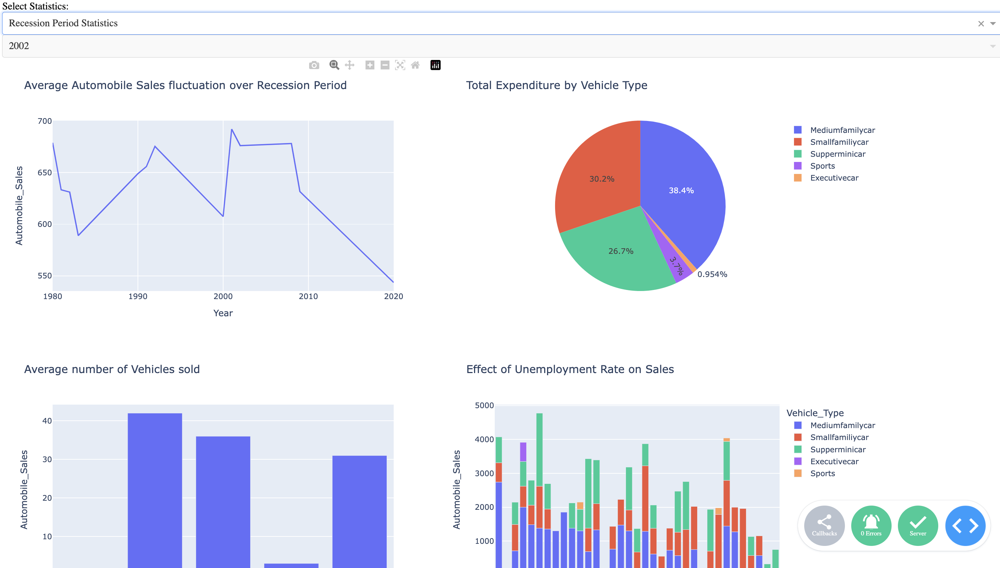

# **Visualizations using Matplotib, Seaborn and Folium** 

In this repository i will be creating visualisations using *Matplotlib, Seaborn, Folium, Plotly and Dash*.

This is a personal rough sheet 

In the ['practice.ipynb'](practice.ipynb) i carried out exploratory Data Analysis using python tools like *Pandas, Matplotlib, and Seaborn* on the Automobile sales data of a company from 1980 to 2023. 
>I investiaged the following:
> * The impact of unemployment on Sales 
> * The impact of recession on sales. 
> * Also to measure the seasonality impact on sales.
> * I also checked how each vehicle type faired during different seasons, <b>Recession and Non Recession</b> 
> * Amount of money spent on Advertisement in both periods and also which Vehicle type

I communicated my findings as inferences in the notebook.

I also utilised **Folium** to create a Map view of the dataset to give a better perspective on the sales during recession. 

I used [Dash](https://dash.plotly.com/) to create a custom made Dashboard to show a summary of the the analysis, to better communicate the findings. 

The dashboard consists of the report of the <b>Yearly Sales Statistics</b> and also the <b>Recession Period statistics</b>

On the dashboard, I created a toggle to switch between the two selections 

You can also select the year of interest in a dropdown: 

### Yearly Sales Statistics 

### Recession Period 

 
 
 

Watch this video [here](media/dashboard.mov) to see the dashboard in full flow.